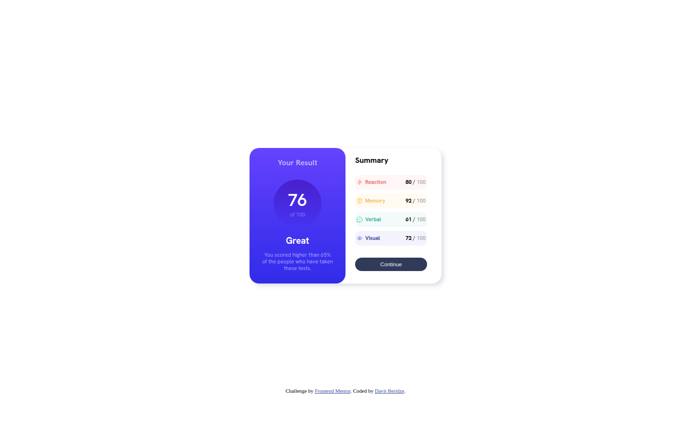
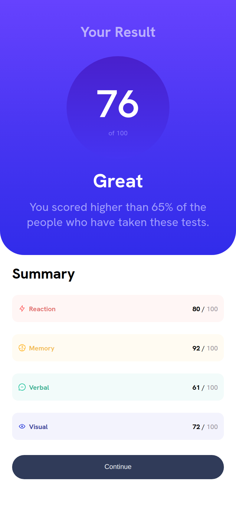

# Results Summary Component

My solution to the [Results summary component](https://www.frontendmentor.io/challenges/results-summary-component-CE_K6s0maV) challenge on Frontend Mentor. A test-results card with an overall score and a breakdown by category.





## Features

- Score panel with gradient background
- Category breakdown with colour-coded rows
- Stacks vertically on mobile

## Built with

- Semantic HTML
- CSS with Flexbox and a media query

## Run locally

No build step or dependencies. Open `index.html` in a browser, or serve the folder:

```bash
npx serve .
```
